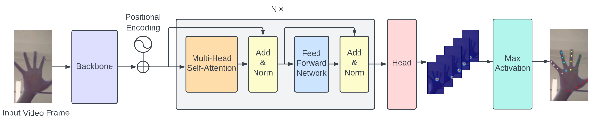
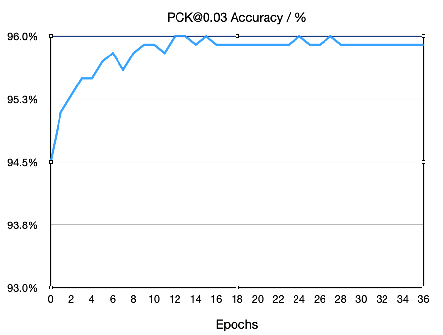
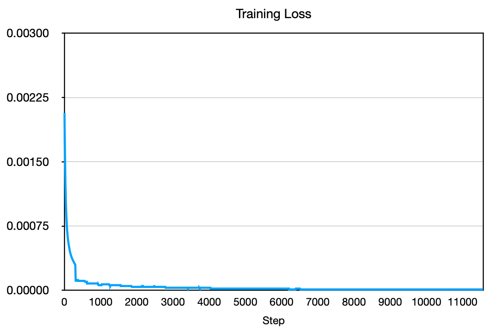
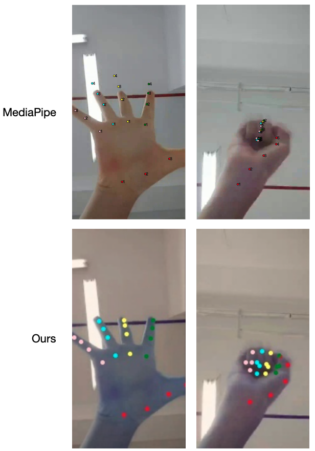

# Hand Keypoint Detection with Transformer -- Pytorch

This repository is mainly built upon Pytorch. We wish to use Transformer to realize hand keypoint detection on videos.

## Architecture

## Results
Currently, the model is trained on 250 videos(63825 frames). Test datasets contains 106 videos(26741 frames).

(The dataset is still in the labeling stage, so only part of the labeled data is used for training and testing. After the labeling is complete, all data will be used for training and testing, and the following statistic will be updated.)

|  Model   | Backbone  |  Pretrain  | Attention Layers | d | h | head | Params(Mb) | PCK@0.03 | Acceleration Error
|  ----  | ----  |  ----  |  ----  | ----  |  ----  |  ----  | ----  |  ----  |----  |
| Transformer Encoder | HRNet | ImageNet  | 6 | 96 | 192 | 1 | 17.456 | 0.953 | 2.308  |

Performance on validation set:

Training loss:

Compare with [Google MediaPipe](https://arxiv.org/pdf/2006.10214.pdf) on some complex scenarios:

